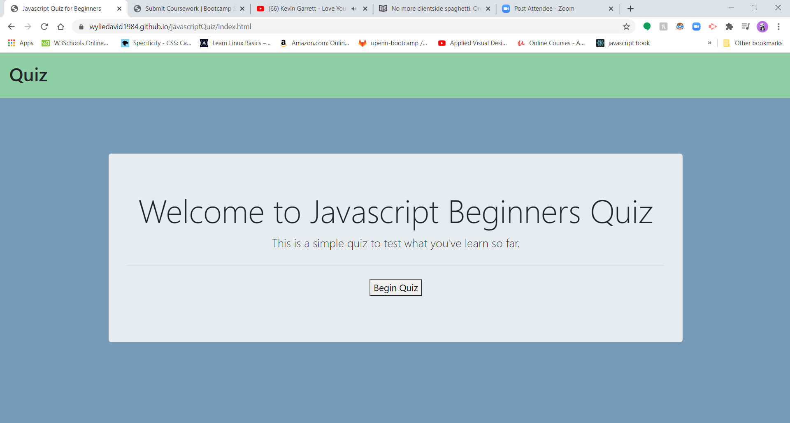
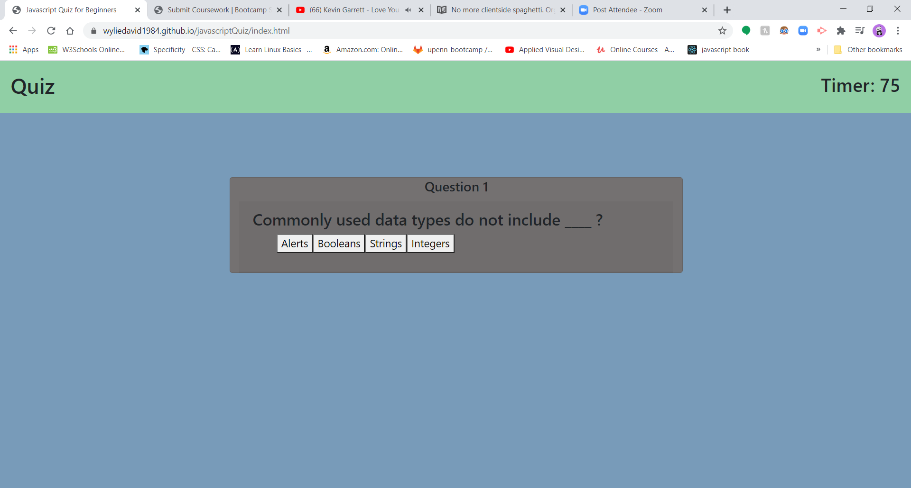
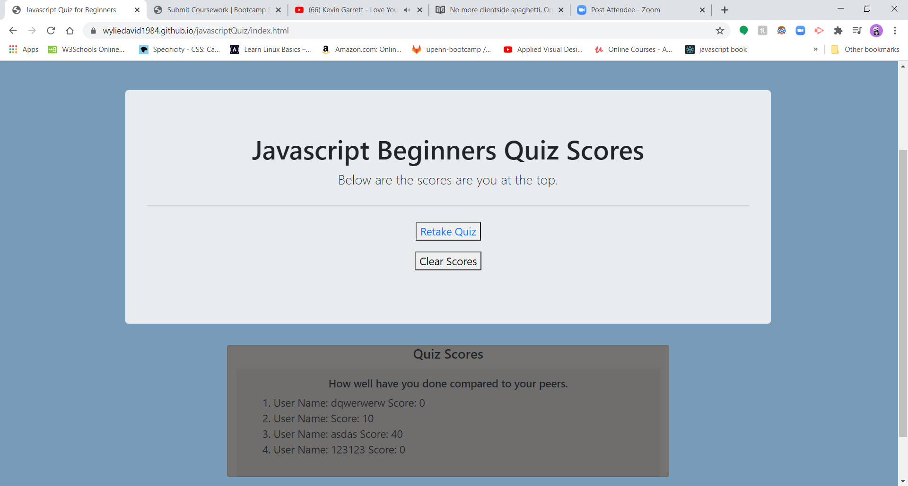
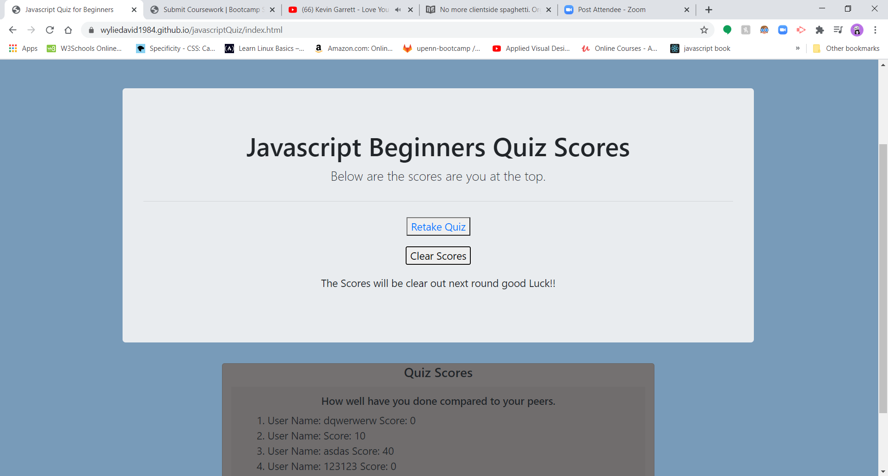
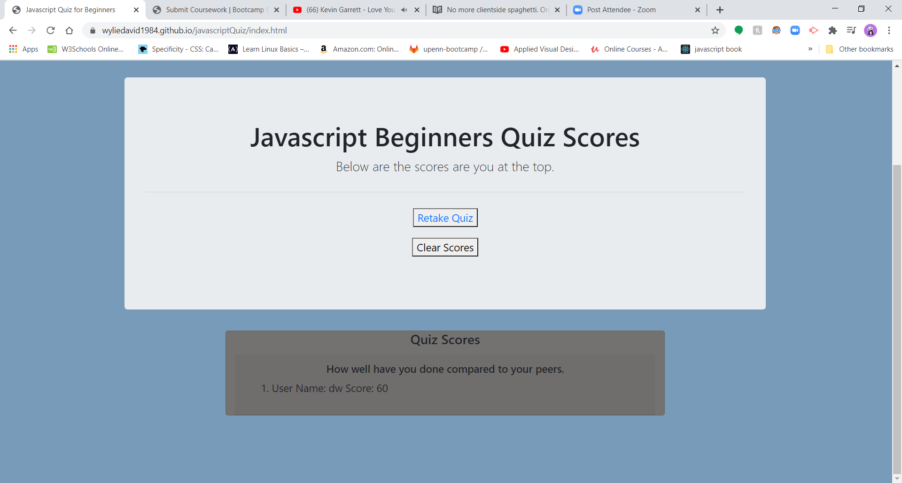

# JavascriptQuiz

## Description

Our project was to create a quiz with html, css, and javascript. I made two basic layouts one for the Quiz and another for High Scores. We needed to make the page dynamic with our javascript knowledge. It has a link to each other html. The quiz is timed, so there is a displayed timer in the top corner of the page. There is start button, once the user presses that button the quiz will begin.  As the user answers each question, they are prompt with another until the end of the quiz. At the end of the quiz the user will be prompted to enter in their initials to be added to the quiz scores. Once directed to the high scores page, names will be displayed with the score they received. They also have to ability to clear out scores.    

## Links
* [Javascript Quiz](https://wyliedavid1984.github.io/javascriptQuiz/index.html)
* [Javascript Quiz Repo](https://github.com/wyliedavid1984/javascriptQuiz)

## Javascript

Javascript

### Variables

We have several variables in this project, All globals are declared at the top of the javascript page.  The first and biggest variable is the questionBank that houses all the question numbers, questions, answers, and correct answers.  The next several elements were created to select parts of the html, the getElementById method was used to do this. This was done to manipulate content on our page.  Then we created some elements by use the createElement method.  I mainly created buttons and a div for the buttons to be placed in .  The last few were for the counter, iterator, and countdown.  

### Appending

I then appended all the newly made elements to our html with appendChild method. So that they will be displayed on the page. After that I need to hide several of the created element. I use the setAttribute method to set the style display to none til they were needed again. 

### Functions

All the functions
 

#### Set Interval

After that come the first function, timerCountdown uses setInterval method to decrement through our counter(set to a second or 1000 milliseconds).  Once if it reaches zero, I clearInterval timer so it doesn't continue to count forever. This functions hasn't be activated at this point.  After that I have an addEventListener method that listens for the click of the start button that will fire off the startGame function. 

#### Start Game

The startGame function will hide the beginScreen and show our gameScreen.  I also use the removeAttribute method to allow our button visibility again.  The startGame function fires off two more functions.  They are the timerCountdown and generateQuestion.  

#### Generate Questions

In generateQuestion function I put together our questions.  I reference the questionBank in this variable over and over through our iterations until I run out of questions.  I use textContent notation to bring our content to life.  I also set all the attribute of all the buttons values with setAttribute method.  It goes down to the answer array in the object in order to get the text for both the button and also the value of the button.  Lastly I use event listeners to at the end of the function to trigger our keepScore function. 

#### Keep Score

Keep score function will keep score of how many questions were answered correctly.  I created a variable to store the correct answer in. Before checking whether or not the user has answered the question correctly.  After the check is done the function will either give the user an addition of ten points or the will lose 10 seconds off of the timer.  After it has done that, it will then check how far into our question bank we have gone.  If it has iterated over the entire length of the questionBank array.  Then it'll return the gameOver functions.  If the functions has then it adds one to the iterator. and fires off the generateQuestion function again.  When it gets through the questionBank array then the gameOver function will activate. 

#### Game Over

Once activated it changes the display of the buttons to none again, and also the quizScreen to a display of none.  It displays the gameOverScreen that has an input field to take the users initials.  It also has a submit button that is attached to an addEventListener of click. It is nested in a form tag so to prevent it from auto reloading we use the event.preventDefault function.  Then it gets the user input by setting it equal to a variable using getElementById().value to get the value rather than the element. I take that data and enter into a variable object. Push it up to a global array. After that I check to see if there is anything in local storage and get that and push that up to the array. It is then  stringified and sent to local storage for later use.  

#### Post Score

The postScore function is used to add our scores to the dom and make it visible.  I get an element from the dom to append to. The new element that is created on the next line. UserList is then appended to the dom by highScore.  I reference to the global variable array.  That has already parsed local storage and from the button listener of submit everything has been push up to that global array. I will then create a li for each index in the array that we parsed globally from local storage. In the same instance, it creates content to the li and then appends it to the dom.  So that the quiz score page will display the scores.

#### Clear Button

The last thing that I added was another eventlistener for a button.  I wanted to allow the user the ability to clear the current scores.  So using the method of clear on local storage it clears the data.  I also had it add text to let the user know that upon playing another game the scores will have been removed.

## Screen Shot

Screen Shot

## Credits

* [Stack Overflow general research](https://stackoverflow.com/) 
* [W3schools general research](https://www.w3schools.com/default.asp)
* [Mdn web docs general research](https://developer.mozilla.org/en-US/)
* [Bootstrap general research](https://getbootstrap.com/)
* [AskBCS]

